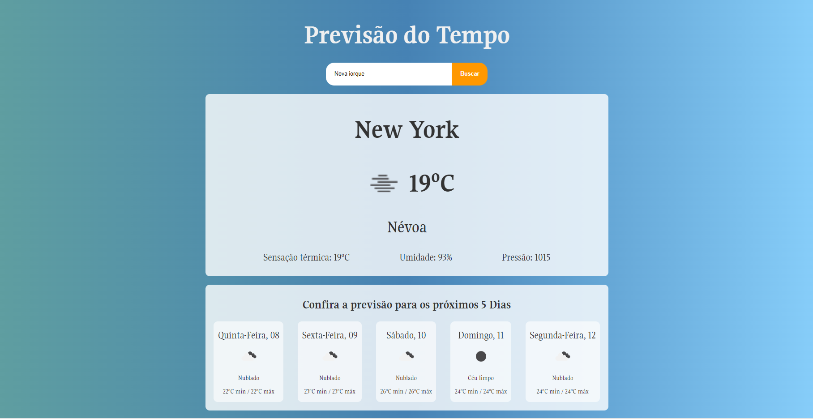
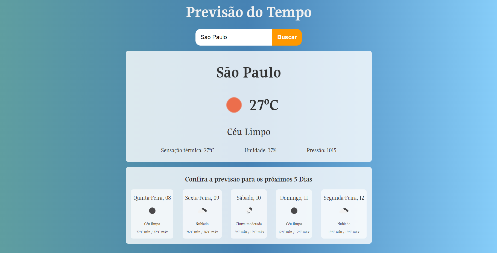
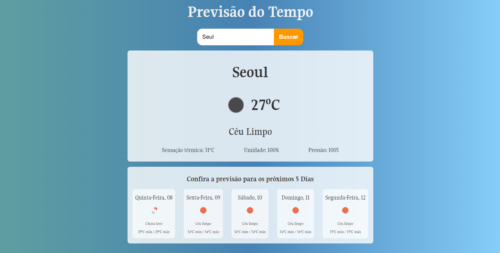

# React + Vite
🌦️ Previsão do Tempo Interativa 🌦️

🚀 O que é?

Um aplicativo web desenvolvido com React, JavaScript, HTML5 e CSS3 que oferece previsões do tempo detalhadas! Com uma interface moderna e intuitiva, você pode conferir a previsão do tempo atual e também obter uma visão geral das condições meteorológicas para os próximos 5 dias. ☀️🌧️🌤️

🧩 Funcionalidades:

Previsão Atual: Veja o clima exato no momento da pesquisa, com informações sobre temperatura, umidade e condições gerais. 🌡️💧

Previsão para 5 Dias: Planeje com antecedência com uma visão detalhada do tempo nos próximos dias. 🌈📅

Interface Amigável: Design limpo e responsivo que se adapta a diferentes dispositivos. 📱💻

🎯 Por que usar?

Seja para planejar uma viagem, escolher a roupa certa ou apenas acompanhar o clima, este aplicativo oferece uma experiência precisa e prática. Experimente e nunca mais seja pego de surpresa pelo tempo! 🌍✨

🔗 Como usar?

Digite o nome da cidade ou localização desejada e obtenha a previsão do tempo em segundos. Simples e rápido! ⏱️🌎

# Imagens do meu projeto:

